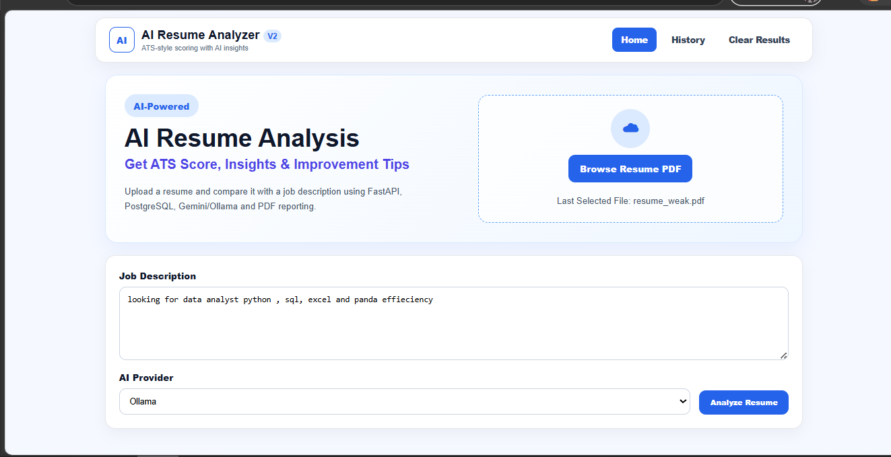
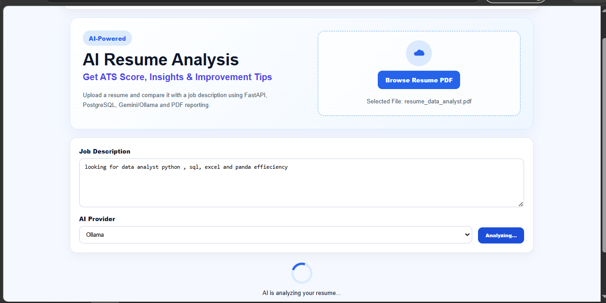
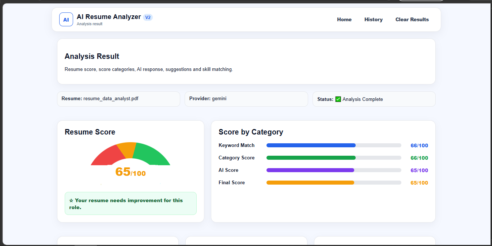
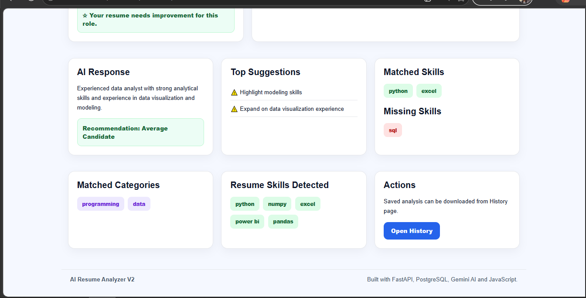
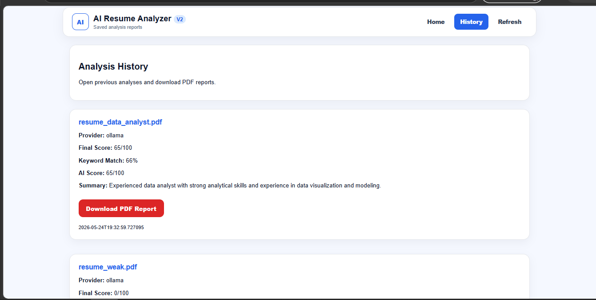

# AI Resume Analyzer V2

An AI-powered resume analysis platform that helps job seekers evaluate their resumes against job descriptions using ATS-style scoring, skill gap analysis, and AI-generated recommendations.

Built as a portfolio project to demonstrate backend development, database integration, API development, and AI-powered application design.

---

## Project Highlights

✅ Resume PDF Upload

✅ ATS-Style Resume Scoring

✅ Job Description Matching

✅ Skill Gap Analysis

✅ AI Recommendations

✅ Gemini AI Integration

✅ Ollama Local LLM Integration

✅ Analysis History Tracking

✅ PDF Report Generation

✅ PostgreSQL Database Storage

---

## Why I Built This

Recruiters often use Applicant Tracking Systems (ATS) to filter resumes before they reach human reviewers.

This project helps users understand:

- How well their resume matches a job description
- Which skills are missing
- How to improve their resume score
- AI-generated suggestions for improvement

---

## Tech Stack

### Backend
- Python
- FastAPI
- SQLAlchemy

### Database
- PostgreSQL
- Neon Database

### AI Integration
- Google Gemini API
- Ollama Local LLM

### Frontend
- HTML
- CSS
- JavaScript

---

## Screenshots

### Home Page

### Results Page

### History Page

---

## Key Learning Outcomes

Through this project I gained practical experience with:

- REST API Development
- Database Design
- PostgreSQL Integration
- AI API Integration
- Local LLM Integration
- PDF Generation
- Frontend & Backend Communication
- Git and GitHub Workflow

---

## Future Improvements

- User Authentication (JWT)
- Resume Comparison Feature
- Dashboard Analytics
- Docker Support
- Cloud Deployment

---

## Author

**Laiba Rafiq**

